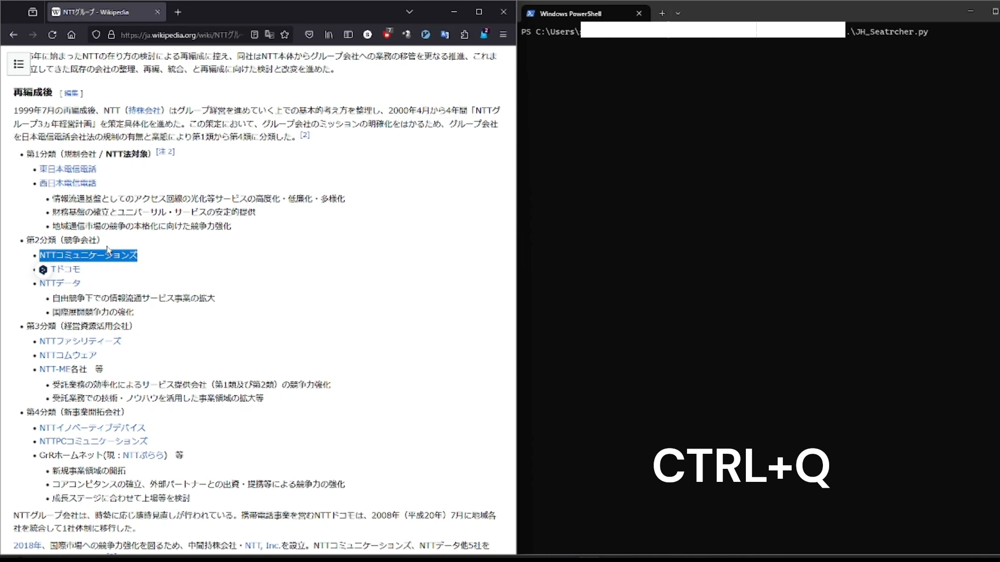

# JobHunting_Searcher

## This program enables you to search [openwork](https://www.openwork.jp) for companies that you have never heard of or have been curious about.

### How to Use
While the program is running, typing "CTRL+Q" with text selected will automatically open a browser and in a new tab, you will see reviews of the company for the selected text.

To close the browser, use "CTRL+SHIFT+Q". Please note that this function is not provided by me.

Also, "CTRL+Q" is not a shortcut assigned to web browsers (at least, firefox and google chrome). Unless you have a special shortcut setup, it will not interfere with the programs I have created.

It also meets the requirement of interference with vimium, as I am creating it for an efficiencyist who does not like to use the mouse (lol).
If you do not understand, please refer to the video.

### Use JobHunting_Searcher

